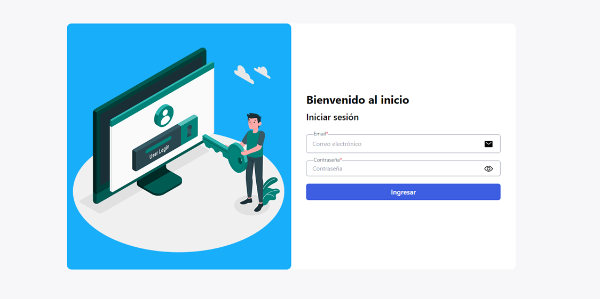
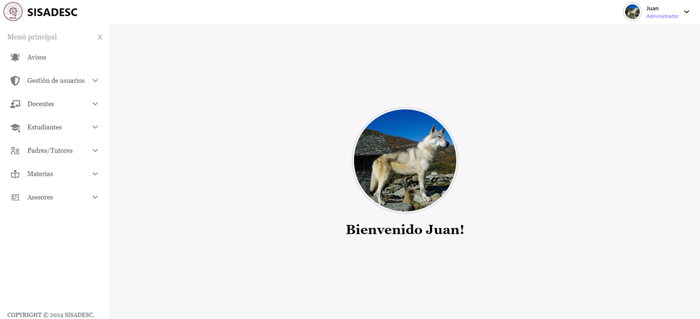
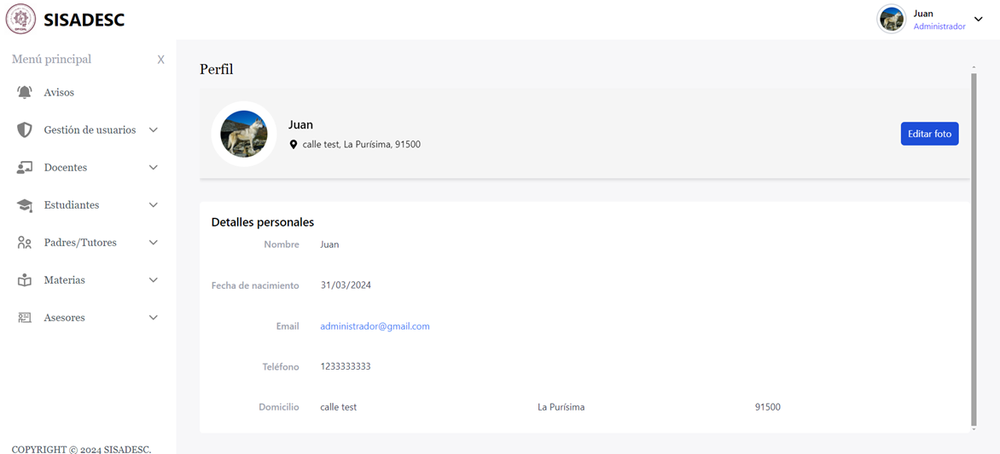
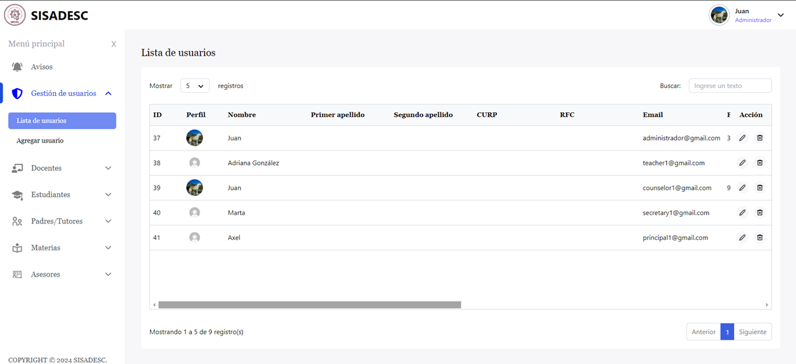
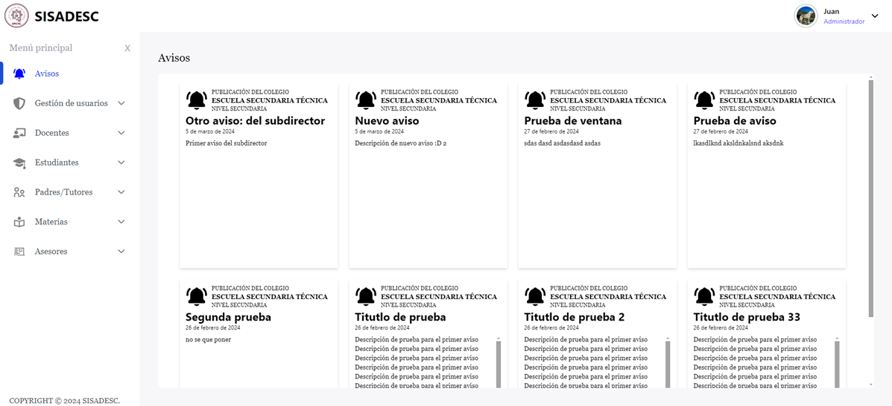
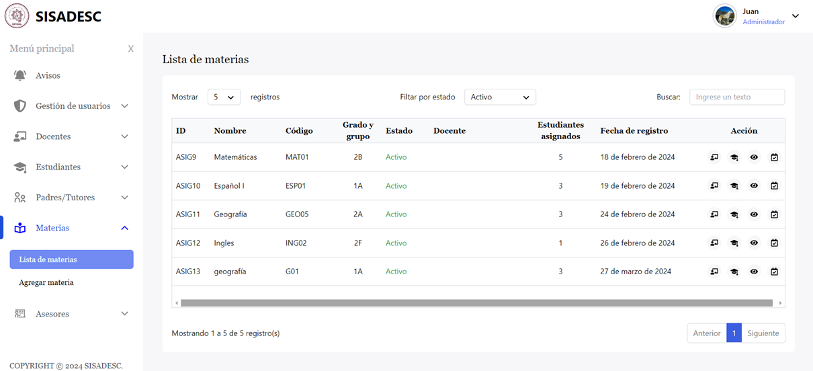
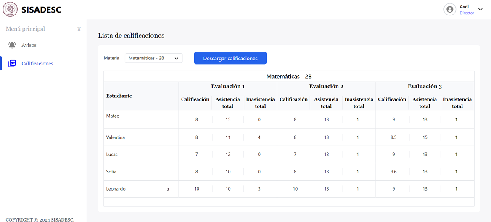
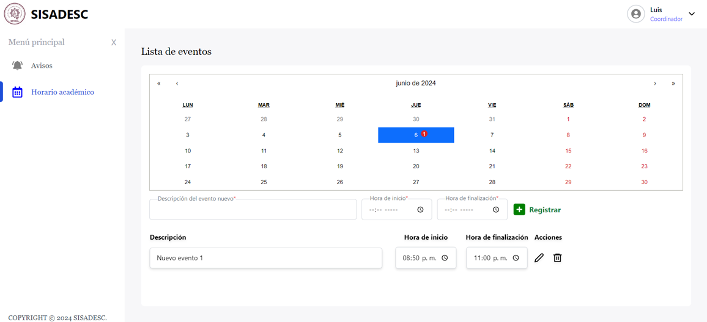
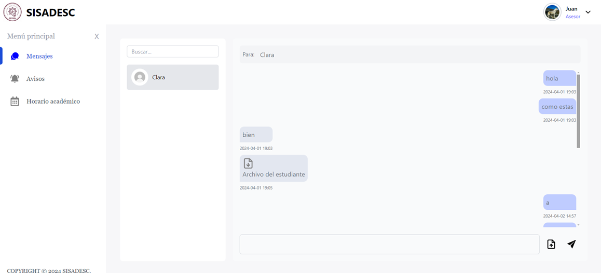

# SISADESC - Sistema de Administración Escolar (Frontend)

Este es el backend del Sistema de Administración Escolar, desarrollado con Node.js y Express.

## Descripción
Este proyecto forma parte de un Sistema de Administración Escolar que facilita la comunicación entre los padres de familia y la institución educativa. Proporciona una interfaz amigable y eficiente para interactuar con los datos del sistema. 
Da clic en este link para dirigirte al [Backend](https://github.com/Alba2809/sisadesc-api) del proyecto.

## Capturas generales
**Inicio de sesión**:



**Bienvenida**:



**Perfil**:



**Tabla de usuarios**:



**Avisos**:



**Tabla de materias**:



**Tabla de calificaciones**:



**Lista de eventos**:



**Chat**:



## Tecnologías utilizadas
- **React**: Biblioteca para construir interfaces de usuario,
- **Vite**: Herramienta de construcción rápida para aplicaciones web modernas.
- **Tailwind CSS**: Framework CSS utilitario para diseñar rápidamente interfaces.

## Librerías Utilizadas
- **react**: Biblioteca de JavaScript para crear interfaces de usuario.
- **axios**: Librería para hacer peticiones HTTP desde el navegador o Node.js.
- **framer-motion**: Librería para añadir animaciones fluidas a componentes React.
- **js-cookie**: Utilidad para manejar cookies en el navegador.
- **react-calendar**: Componente de calendario para React.
- **react-hook-form**: Librería para la gestión de formularios en React.
- **react-hot-toast**: Notificaciones toast para React.
- **react-icons**: Iconos para React.
- **react-router-dom**: Enrutamiento para aplicaciones web React.
- **react-textarea-autosize**: Textareas redimensionables para React.
- **react-to-print**: Componente para imprimir elementos React.
- **serve**: Utilidad para servir archivos estáticos. Se utilizó para producción.
- **socket.io-client**: Cliente para la comunicación en tiempo real con Socket.IO.
- **tailwind**: Framework CSS para diseñar interfaces modernas.

## Instalación
1. **Clonar repositorio**:
   ```bash
   git clone https://github.com/Alba2809/sisadesc
   cd sisadesc
   ```
2. **Instalar dependencias**:
   ```bash
   npm install
   ```
3. **Configurar las variables de entorno**:
   - **VITE_BACKEND_URL**: URL del backend.

4. **Ejecución**:
   ```bash
   npm run dev
   ```

## Uso
- Por defecto la aplicación estará corriendo en `http://localhost:5173`.
- El frontend se comunicará con el [backend](https://github.com/Alba2809/sisadesc-api) para gestionar la información del sistema de administración escolar.


COPYRIGHT © 2024 SISADESC.